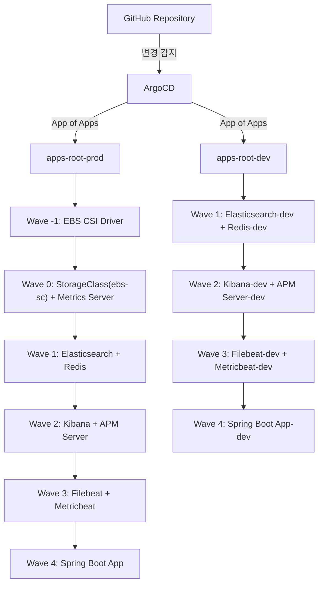
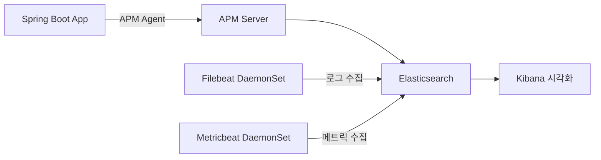
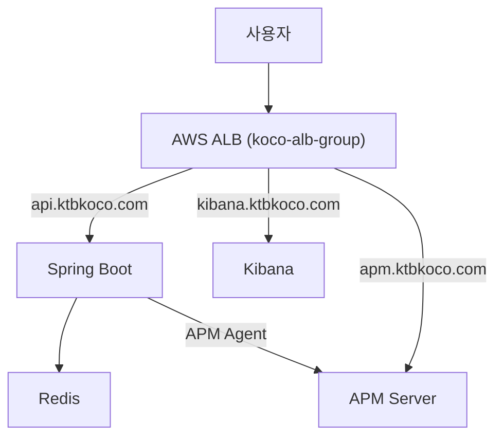

# 21-iceT-gitops

## 한 줄 소개

EKS 기반 Spring Boot 애플리케이션을 ArgoCD App of Apps 패턴으로 관리하는 GitOps 리포지토리

---


**이 리포지토리는 EKS 인프라를 프로비저닝하는 [kakaotech-eks-infra](https://github.com/KIMSEOKWON00/kakaotech-eks-infra) 프로젝트와 연동되어 동작합니다.**

Spring Boot 백엔드, ELK 스택(로그/메트릭/APM 모니터링), Redis, 클러스터 인프라 애드온(EBS CSI Driver, StorageClass, metrics-server)까지 전체 애플리케이션·인프라 스택을 하나의 Git 리포지토리에서 선언적으로 관리합니다. `prod`/`dev` 두 환경을 독립된 App of Apps 루트로 분리해 운영합니다.

---

## 목차

- [🏗️ 전체 아키텍처](#️-전체-아키텍처)
- [🔁 배포 방식](#-배포-방식)
- [🔗 연관 프로젝트](#-연관-프로젝트)
- [📦 관리 서비스 목록](#-관리-서비스-목록)
- [🗂️ 프로젝트 구조](#️-프로젝트-구조)
- [🚀 App of Apps 패턴](#-app-of-apps-패턴)
  - [syncWave 배포 순서](#syncwave-배포-순서)
- [🌿 Spring Boot 자체 Helm Chart](#-spring-boot-자체-helm-chart)
  - [주요 설계 포인트](#주요-설계-포인트)
  - [prod/dev 환경 분리](#proddev-환경-분리)
- [📊 ELK 스택 모니터링](#-elk-스택-모니터링)
  - [접근 도메인 (prod 기준)](#접근-도메인-prod-기준)
- [🔧 트래픽 흐름](#-트래픽-흐름)
- [✅ CI — GitHub Actions Helm Lint](#-ci--github-actions-helm-lint)
- [🚦 시작하기](#-시작하기)
  - [사전 조건](#사전-조건)
  - [App of Apps 등록](#app-of-apps-등록)
- [⚠️ 보안 주의사항](#️-보안-주의사항)
- [🛠️ 기술 스택](#️-기술-스택)

---

## 🏗️ 전체 아키텍처



- `apps-root-prod`, `apps-root-dev`는 완전히 독립된 두 개의 루트 Application으로, 한쪽 환경의 동기화 실패가 다른 환경에 영향을 주지 않습니다.
- dev 환경은 EBS CSI Driver / `ebs-sc` / metrics-server를 클러스터 싱글톤 인프라로 간주해 prod 설치분을 그대로 공유하므로 Wave -1, 0이 없습니다.
- 더 상세한 Mermaid 다이어그램(ELK 데이터 흐름, App of Apps 구조 등)은 [`docs/architecture.md`](./docs/architecture.md)에서 확인할 수 있습니다.

> 📸 *스크린샷 자리: ArgoCD UI에서 `apps-root-prod`/`apps-root-dev`가 Synced 상태로 표시되는 화면 (추가 예정)*

---

## 🔁 배포 방식

이 리포지토리를 ArgoCD에 연결하면 아래 방식으로 배포가 진행됩니다.

1. **GitOps App of Apps** — 최상위 Application(`apps-root-dev`/`apps-root-prod`)이 `argo-apps/apps-dev`·`apps-prod` 디렉토리를 재귀 참조(`directory.recurse: true`)해 하위 Application들을 자동 생성합니다. `kubectl apply -f argo-apps/app-of-apps-*.yaml` 한 번으로 전체 스택이 등록됩니다.
2. **완전 자동 동기화 (Auto-Sync)** — 모든 Application이 `syncPolicy.automated: { prune: true, selfHeal: true }`로 설정되어 있어, Sync 버튼 없이 Git 변경이 즉시 반영되고(prune) 클러스터에서 수동으로 변경된 리소스는 자동으로 Git 상태로 복구됩니다(selfHeal) — Push가 아닌 **Pull 기반 GitOps**입니다.
3. **sync-wave 기반 순차 배포** — `argocd.argoproj.io/sync-wave` 어노테이션으로 인프라(EBS CSI Driver) → 스토리지/메트릭 → 데이터스토어(ES/Redis) → 모니터링(Kibana/APM) → 수집기(Filebeat/Metricbeat) → 애플리케이션(Spring) 순으로 단계적으로 배포됩니다. 자세한 표는 [App of Apps 패턴](#-app-of-apps-패턴) 참고.
4. **환경별 values 오버라이드** — Spring Chart(`apps/base/spring`) 하나를 prod/dev 공용으로 사용하고, ArgoCD Application의 `helm.valueFiles`로 `env/dev/values-dev.yaml` / `env/prod/values-prod.yaml`을 오버라이드해 환경을 분리합니다.
5. **애플리케이션 배포 전략** — `apps/base/spring/templates/deployment.yaml`은 표준 `apps/v1 Deployment`로, 별도 `strategy` 지정이 없어 쿠버네티스 기본값인 **RollingUpdate**로 배포됩니다. (참고: 최상위 `helm/` 폴더에 Argo Rollouts Blue-Green 실험 차트가 있으나 어떤 Application에서도 참조되지 않는 미사용 상태)

---

## 🔗 연관 프로젝트

이 리포지토리는 단독으로 동작하지 않고, 별도의 Terraform 인프라 프로젝트 **kakaotech-eks-infra**와 함께 사용됩니다.

| 항목 | kakaotech-eks-infra | 이 리포 (GitOps) |
|---|---|---|
| EKS 클러스터 생성 | ✅ | ❌ |
| AWS Load Balancer Controller 설치 | ✅ (Helm) | ❌ |
| ArgoCD 설치 | ✅ (Helm) | ❌ |
| VPC / IAM / Security Group / ECR | ✅ | ❌ |
| Spring Boot 애플리케이션 배포 | ❌ | ✅ |
| ELK 스택 배포 | ❌ | ✅ |
| Redis 배포 | ❌ | ✅ |
| EBS CSI Driver 배포 (ArgoCD Application) | ❌ | ✅ |

> **참고**: EBS CSI Driver의 IRSA 역할(`AmazonEKS_EBS_CSI_Driver_IRSA`)은 kakaotech-eks-infra의 Terraform(`koco/modules/iam/main.tf`)에서 생성되지만, 실제 드라이버 Helm 배포는 이 리포지토리의 ArgoCD Application(`argo-apps/apps-prod/ebs-csi-driver-application.yaml`)이 담당합니다. IAM 리소스 정의와 워크로드 배포가 두 리포지토리에 나뉘어 있는 구조입니다.

전체 구성 순서는 [`BOOTSTRAP.md`](./BOOTSTRAP.md#연관-프로젝트)를 참고하세요.

---

## 📦 관리 서비스 목록

| 서비스 | Chart | Wave | 역할 |
|---|---|---|---|
| Spring Boot | 자체 (`apps/base/spring`) | 4 | 백엔드 API 서버 (prod/dev) |
| Elasticsearch | 공개 (elastic/helm-charts) | 1 | 로그/메트릭/APM 데이터 저장 및 검색 |
| Redis | 공개 (Bitnami) | 1 | 캐시/세션 저장소 (standalone) |
| Kibana | 공개 (elastic/helm-charts) | 2 | 데이터 시각화 대시보드 |
| APM Server | 공개 (elastic/helm-charts) | 2 | Spring Boot APM 트레이스 수신 |
| Filebeat | 공개 (elastic/helm-charts) | 3 | 노드/컨테이너 로그 수집 (DaemonSet) |
| Metricbeat | 공개 (helm.elastic.co) | 3 | 시스템 메트릭 수집 (DaemonSet) |
| AWS EBS CSI Driver | 공개 (aws-ebs-csi-driver) | -1 | EBS 볼륨 동적 프로비저닝 (prod 소유, dev와 공유) |
| EBS StorageClass (`ebs-sc`) | raw manifest | 0 | gp3 기반 동적 프로비저닝 대상 (prod 소유, dev와 공유) |
| metrics-server | 공개 (kubernetes-sigs) | 0 | HPA용 클러스터 리소스 메트릭 (prod 소유, dev와 공유) |

---

## 🗂️ 프로젝트 구조

```
.
├── apps
│   └── base
│       └── spring                  # Spring Boot 자체 Helm Chart (prod/dev 공용)
│           ├── Chart.yaml
│           ├── templates
│           │   ├── deployment.yaml
│           │   ├── hpa.yaml
│           │   ├── ingress.yaml
│           │   ├── pvc.yaml
│           │   └── service.yaml
│           └── values.yaml
├── argo-apps
│   ├── app-of-apps-dev.yaml        # dev 루트 Application
│   ├── app-of-apps-prod.yaml       # prod 루트 Application
│   ├── apps-dev                    # dev 환경 Application 정의 (7개)
│   │   ├── apm-server.yaml
│   │   ├── elasticsearch-application.yaml
│   │   ├── filebeat.yaml
│   │   ├── kibana.yaml
│   │   ├── metricbeat.yaml
│   │   ├── redis-application.yaml
│   │   └── spring-application.yaml
│   └── apps-prod                   # prod 환경 Application 정의 (10개 + StorageClass)
│       ├── apm-server.yaml
│       ├── ebs-csi-driver-application.yaml
│       ├── ebs-sc.yaml
│       ├── elasticsearch-application.yaml
│       ├── filebeat.yaml
│       ├── kibana.yaml
│       ├── metricbeat.yaml
│       ├── metrics-server.yaml
│       ├── redis-application.yaml
│       └── spring-application.yaml
├── docs
│   ├── architecture.md              # Mermaid 아키텍처 다이어그램
│   └── analysis                     # 구조 분석 문서 (step1~6, final_analysis)
├── env
│   ├── dev
│   │   └── values-dev.yaml          # Spring 차트 dev 오버라이드
│   └── prod
│       └── values-prod.yaml         # Spring 차트 prod 오버라이드
├── helm                              # 실험적 차트 (미사용, helm/README.md 참고)
├── BOOTSTRAP.md                      # App of Apps 최초 등록 가이드
├── SECRET-SETUP.md                   # spring-env-secret 사전 생성 가이드
└── README.md
```

> `helm/` 폴더는 Argo Rollouts Blue-Green 배포 및 OpenTelemetry 사이드카 적용을 검토하던 실험용 차트로, 어떤 ArgoCD Application에서도 참조되지 않습니다. 실제 운영 차트는 `apps/base/spring/`입니다.

---

## 🚀 App of Apps 패턴

```mermaid
graph TD
    ROOT_P[app-of-apps-prod] --> A1[ebs-csi-driver]
    ROOT_P --> A2[ebs-sc]
    ROOT_P --> A3[metrics-server]
    ROOT_P --> A4[elasticsearch]
    ROOT_P --> A5[redis]
    ROOT_P --> A6[kibana]
    ROOT_P --> A7[apm-server]
    ROOT_P --> A8[filebeat]
    ROOT_P --> A9[metricbeat]
    ROOT_P --> A10[spring-prod]

    ROOT_D[app-of-apps-dev] --> D1[elasticsearch-dev]
    ROOT_D --> D2[redis-dev]
    ROOT_D --> D3[kibana-dev]
    ROOT_D --> D4[apm-server-dev]
    ROOT_D --> D5[filebeat-dev]
    ROOT_D --> D6[metricbeat-dev]
    ROOT_D --> D7[spring-dev]
```



두 루트 Application 모두 `directory.recurse: true`로 각각 `argo-apps/apps-prod/`, `argo-apps/apps-dev/`를 재귀 참조합니다. `metadata.name`과 `source.path`를 제외한 나머지 필드(repoURL, targetRevision, destination, syncPolicy)는 완전히 동일한 구조입니다.

### syncWave 배포 순서

| Wave | 서비스 | 배포 이유 |
|---|---|---|
| -1 | EBS CSI Driver | 스토리지 드라이버 최우선 설치 — 이 드라이버 없이는 StorageClass가 있어도 실제 볼륨 프로비저닝이 동작하지 않음 |
| 0 | EBS StorageClass, Metrics Server | CSI Driver 설치 후 StorageClass 생성 / HPA를 위한 메트릭 소스 사전 준비 |
| 1 | Elasticsearch, Redis | 데이터 레이어 — 다른 컴포넌트가 의존하는 저장소 |
| 2 | Kibana, APM Server | Elasticsearch 준비 후 시각화/APM 수신 |
| 3 | Filebeat, Metricbeat | 수집기 — ES가 준비된 이후 데이터 전송 시작 |
| 4 | Spring Boot App | 모든 의존성(Redis, ES/APM, HPA용 metrics-server) 준비 후 최종 배포 |

dev는 클러스터 싱글톤 인프라(Wave -1, 0)를 prod와 공유하므로 Wave 1부터 시작합니다.

---

## 🌿 Spring Boot 자체 Helm Chart

### 주요 설계 포인트

**이미지 관리**: `deployment.yaml`은 이미지 경로를 하드코딩하지 않고 values를 참조합니다.

```yaml
image: "{{ .Values.image.repository }}:{{ .Values.image.tag }}"
```

**카카오 OAuth `/oauth` 경로**: `ingress.yaml`은 `/api`와 `/oauth` 두 경로를 모두 동일한 백엔드 서비스로 라우팅합니다.

```yaml
- path: /api
  backend: { service: { name: "{{ .Release.Name }}" } }
- path: /oauth
  backend: { service: { name: "{{ .Release.Name }}" } }
```

**ACM 인증서 values화**: `ingress.yaml`의 `certificate-arn` 어노테이션이 `.Values.ingress.certificateArn`을 참조합니다.

```yaml
alb.ingress.kubernetes.io/certificate-arn: {{ .Values.ingress.certificateArn | quote }}
```

- base `values.yaml`은 `certificateArn: ""`(빈 값) — 환경별로 반드시 오버라이드해야 함을 강제
- 실제 ARN은 `env/prod/values-prod.yaml` 한 곳에만 존재하며, 인증서 교체 시 이 파일 한 곳만 수정하면 됨
- `*.ktbkoco.com` 와일드카드 인증서 1개로 `api`/`kibana`/`apm` 3개 서브도메인을 모두 커버하도록 구성 (자세한 발급/확인 절차는 [`BOOTSTRAP.md`](./BOOTSTRAP.md#acm-인증서-설정) 참고)

**HPA 오토스케일링**: `hpa.yaml`은 `.Values.autoscaling.enabled`일 때만 조건부 생성되며, `scaleTargetRef.name`이 `{{ .Release.Name }}`으로 Deployment와 정확히 일치합니다.

| 항목 | base 기본값 | prod/dev 오버라이드 |
|---|---|---|
| `minReplicas` | `1` | `2` |
| `maxReplicas` | `5` | `5` |
| CPU 기준 (`targetCPUUtilizationPercentage`) | `70%` | `70%` |
| 메모리 기준 (`targetMemoryUtilizationPercentage`) | `80%` | `80%` |

**PVC 로그 스토리지**: `pvc.yaml`은 `.Values.persistence.enabled`일 때만 조건부 생성되고, `deployment.yaml`의 `volumeMounts`/`volumes`가 동일한 PVC(`{{ .Release.Name }}-logs`)를 참조해 실제로 마운트됩니다.

| 항목 | 값 |
|---|---|
| PVC 이름 | `{{ .Release.Name }}-logs` (prod: `spring-prod-logs`, dev: `spring-dev-logs`) |
| 용량 (`persistence.size`) | `5Gi` |
| storageClass (`persistence.storageClass`) | `ebs-sc` |
| 마운트 경로 (`persistence.mountPath`) | `/app/logs` |

**환경변수 주입**: 개별 키가 아닌 `envFrom.secretRef`로 `spring-env-secret` 전체를 일괄 주입합니다. 이 Secret은 리포지토리에 정의되어 있지 않은 외부 의존 리소스로, ArgoCD 배포 전 클러스터에 사전 생성이 필요합니다 ([`SECRET-SETUP.md`](./SECRET-SETUP.md) 참고).

### prod/dev 환경 분리

| 항목 | prod (`values-prod.yaml`) | dev (`values-dev.yaml`) |
|---|---|---|
| `replicaCount` | (미지정, base 기본값 `2` 사용) | `1` |
| `image.tag` | (미지정, base 기본값 `v1.0.3` 사용) | `latest` |
| `resources.requests` | (미지정, base 기본값 `cpu 250m / memory 512Mi` 사용) | `cpu 100m / memory 256Mi` |
| `ingress.host` | `api.ktbkoco.com` | `koco-test.click` |
| `ingress.certificateArn` | 실제 ACM ARN 지정 | `""` (dev용 인증서 미발급 상태) |
| `autoscaling.minReplicas/maxReplicas` | `2` / `5` | `2` / `5` (prod와 동일) |
| `persistence.size/storageClass` | `5Gi` / `ebs-sc` | `5Gi` / `ebs-sc` (prod와 동일) |

---

## 📊 ELK 스택 모니터링



Filebeat/Metricbeat/APM Server 모두 Logstash를 거치지 않고 `elasticsearch-master.elk.svc:9200`(dev: `elk-dev` 네임스페이스)에 직접 데이터를 전송합니다. 기존 Logstash 파이프라인은 `input`이 `stdin {}`으로만 구성되어 있어 외부에서 데이터를 받는 리스너가 없는 유휴 상태였고, 실질 역할이 없음이 확인되어 제거되었습니다.

### 접근 도메인 (prod 기준)

| 서비스 | 도메인 | Ingress |
|---|---|---|
| Spring Boot API | `api.ktbkoco.com` (`/api`, `/oauth`) | 활성화 (`koco-alb-group` 공유) |
| Kibana | `kibana.ktbkoco.com` | 활성화 (`koco-alb-group` 공유) |
| APM Server | `apm.ktbkoco.com` | 활성화 (`koco-alb-group` 공유) |

dev 환경은 Kibana/APM Server의 Ingress가 비활성화되어 있어(prod ALB 그룹·인증서 공유 문제 회피), 외부 도메인으로 노출되지 않습니다.

> 📸 *스크린샷 자리: Kibana 대시보드 화면 (추가 예정)*

---

## 🔧 트래픽 흐름



> Spring/Kibana/APM Server 세 Ingress가 `alb.ingress.kubernetes.io/group.name: koco-alb-group`으로 동일한 ALB를 공유하는 구조는 각 서비스의 Ingress 정의에서 직접 확인된 사실입니다. CloudFront CDN이나 ArgoCD 접속 도메인처럼 이 GitOps 리포지토리 안에서 정의를 찾을 수 없는 항목은 추측을 피하기 위해 다이어그램에 포함하지 않았습니다(자세한 내용은 [`docs/architecture.md`](./docs/architecture.md#3-트래픽-흐름)의 "확인 필요" 항목 참고).

---

## ✅ CI — GitHub Actions Helm Lint

[`.github/workflows/lint.yaml`](./.github/workflows/lint.yaml) — `main`, `dev` 브랜치로의 push/PR 시 실행:

1. **Helm Lint** — Spring Chart를 `env/prod/values-prod.yaml`로 검증
2. **Helm Lint** — Spring Chart를 `env/dev/values-dev.yaml`로 검증
3. **Helm Template** — prod 값으로 렌더링만 수행해 오류 여부 확인 (출력은 버림)
4. **Helm Template** — dev 값으로 동일하게 렌더링 검증
5. **ArgoCD Application YAML dry-run** — `argo-apps/` 하위 모든 YAML을 `kubectl apply --dry-run=client --validate=false`로 검증 (개별 파일 실패가 파이프라인 전체를 막지 않도록 `|| true` 처리)

Chart 문법 오류와 YAML 문법 오류를 PR 단계에서 사전에 차단하는 것이 목적입니다.

---

## 🚦 시작하기

### 사전 조건

- EKS 클러스터가 생성되어 있어야 함 (kakaotech-eks-infra Terraform 적용 완료)
- AWS Load Balancer Controller 설치 완료 (Terraform helm 모듈에서 자동 설치)
- ArgoCD 설치 완료 (Terraform helm 모듈에서 자동 설치)
- kubectl이 EKS 클러스터에 연결되어 있어야 함
- `spring-env-secret` 사전 생성 완료 ([`SECRET-SETUP.md`](./SECRET-SETUP.md) 참고)

### App of Apps 등록

```bash
# kubectl EKS 연결
aws eks update-kubeconfig --region ap-northeast-2 --name <클러스터명>

# App of Apps 등록 — dev
kubectl apply -f argo-apps/app-of-apps-dev.yaml

# App of Apps 등록 — prod
kubectl apply -f argo-apps/app-of-apps-prod.yaml
```

등록 후에는 ArgoCD UI에서 `apps-root-dev`/`apps-root-prod`가 정상 동기화되는지 확인합니다. 전체 절차와 문제 해결 가이드는 [`BOOTSTRAP.md`](./BOOTSTRAP.md)를 참고하세요.

---

## ⚠️ 보안 주의사항

이 프로젝트는 데모/개발 환경 기준으로 구성되어 있으며, 아래 보안 설정이 비활성화 상태입니다.

| 서비스 | 현재 상태 | 프로덕션 권장 |
|---|---|---|
| Elasticsearch | 인증 비활성화 | `xpack.security.enabled: true` |
| Kibana | 익명 접근 허용 + 인터넷 노출 | OIDC/IP 제한 추가 |
| Redis | 인증 비활성화 | `auth.enabled: true` |
| 자격증명 | 평문 하드코딩 (Filebeat/Metricbeat/APM Server) | Sealed Secrets / External Secrets Operator 사용 |

프로덕션 전환 시 개선 계획(Elasticsearch/Kibana/Redis 인증 활성화, External Secrets Operator 도입)은 [`BOOTSTRAP.md`의 보안 주의사항 섹션](./BOOTSTRAP.md#️-보안-주의사항-데모개발-환경-기준)에 정리되어 있습니다.

---

## 🛠️ 기술 스택


